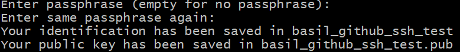

# Setting up a SSH connection with GitHub
SSH - Secure Shell is easier to work with when dealing with automation over https

To Setup a SSH connection with GitHub follow the following steps:

1. Go to your home directory:
```bash
cd ~
```
2. cd into your ssh folder if it exists:
```bash
ls -al
```
if you dont see a ssh folder, then make one: 

```bash
mkdir .ssh
```
3. Enter the ssh folder:

```bash
mkdir .ssh
```
use this command to generate an RSA SSH key pair with a specified key size and email comment. Here's what each option means:

- `ssh-keygen`: This is the command-line utility for generating SSH key pairs.
- `-t rsa`: Specifies the type of key algorithm to use, in this case, RSA.
- `-b 4096`: Sets the key size to 4096 bits. A larger key size generally provides stronger security.
- `-C "youremail@email.com"`: Adds a comment to the key pair, typically an email address or any other identifier. This comment helps identify the key pair if you have multiple keys.
  
```bash
ssh-keygen -t rsa -b 4096 -C “youremail@email.com”
```
this will first ask you to enter your file name, make this descriptive so you can tell it apart from other keys.

then it will ask you to enter a passphrase, leave this empty if you dont want one and press `Enter` ( on client side you would use a passphrase), it will ask for confirmation can press `Enter` again



this will create 2 files, a private key and a public key with a .pub name

4. Go to github settings >  >  Click on new SSH KEY
5. get your public key from the bash terminal with:
```bash
cat filename.pub
```
and copy the contents

6. Enter your title as the same as the filename you get it in step(3) and under key paste the contents of your public key


A key like this should appear after you have made it :

7. Set file permissions:

   ```bash
   chmod 644 basil_github_ssh_test
   ```

   This command sets the file permissions of `basil_github_ssh_test` to `644`. The file will be readable by the owner and readable by the group and others, but not writable or executable.

8. Start the SSH agent:

   ```bash
   eval `ssh-agent -s`
   ```

   This command starts the SSH agent, which manages SSH keys. It prints environment variables that need to be set to use the agent.
   
   Should return something like:
   


9.  Add the SSH private key to the agent:

   ```bash
   ssh-add ~/.ssh/basil_github_ssh_test
   ```

   This command adds the private key file `basil_github_ssh_test` located in the `~/.ssh` directory to the SSH agent, allowing it to manage the key for authentication purposes.

   Should get something like:

10. Test SSH connection to GitHub:

   ```bash
   ssh -T git@github.com
   ```

   This command establishes an SSH connection to the GitHub server (`git@github.com`) and performs a "no-op" check to verify the connection. It helps to ensure that the SSH key authentication is working correctly.

Should see something similiar to: 

You can now cd to your destination directory and push or clone repos to github using your new SSH connection.

>Note: When cloning a repository from Github, use the SSH link
```bash
git clone "link"
```